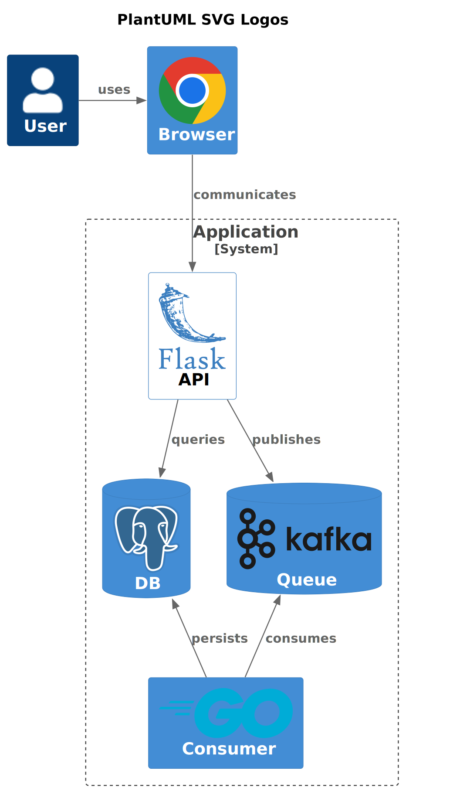

# PlantUML SVG Logos

A huge collection of SVG logos for [PlantUML](https://plantuml.com/) based on [gilbarbara/logos](https://github.com/gilbarbara/logos).

This expands on the efforts of [plantuml-stdlib/gilbarbara-plantuml-sprites](https://github.com/plantuml-stdlib/gilbarbara-plantuml-sprites).

The SVG files have been optimized with [svgo](https://github.com/svg/svgo).

_All logos appearing on the site are the property of their respective owners._

## Usage

```plantuml
@startuml

!include <C4/C4_Container>
!define PLANTUML_SVG_LOGOS https://raw.githubusercontent.com/dev-details/plantuml-svg-logos/main/plantuml
!include PLANTUML_SVG_LOGOS/chrome.puml
!include PLANTUML_SVG_LOGOS/flask.puml
!include PLANTUML_SVG_LOGOS/kafka.puml
!include PLANTUML_SVG_LOGOS/postgresql.puml
!include PLANTUML_SVG_LOGOS/go.puml

title PlantUML SVG Logos

HIDE_STEREOTYPE()

Person(user, "User")
Container(browser, "Browser", $sprite="chrome,scale=0.25")

AddElementTag("light", $bgColor="white", $fontColor="black")

System_Boundary(app, "Application") {
  Container(api, "API", $tags="light", $sprite="flask,scale=0.25")
  ContainerDb(db, "DB", $sprite="postgresql,scale=0.25")
  ContainerDb(kafka, "Queue", $sprite="kafka,scale=0.25")
  Container(consumer, "Consumer", $sprite="go,scale=0.25")
}

Rel_R(user, browser, "uses")
Rel_D(browser, api, "communicates")
Rel_D(api, kafka, "publishes")
Rel_U(consumer, kafka, "consumes")
Rel_U(consumer, db, "persists")
Rel_D(api, db, "queries")

@enduml
```

